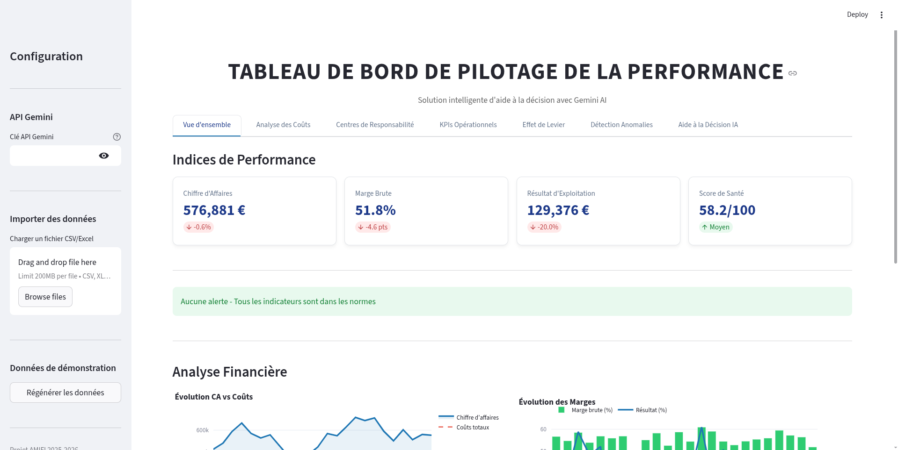

# Tableau de Bord Intelligent de Pilotage de la Performance

## Description du Projet

Ce projet propose une **solution complète de pilotage de la performance organisationnelle** intégrant l'Intelligence Artificielle (Google Gemini AI) pour l'analyse, la détection d'anomalies et l'aide à la décision managériale.

Développé dans le cadre du cours **AMIFI 2025-2026**, ce tableau de bord répond à la problématique suivante :

> **Comment exploiter et améliorer le système d'information pour aider les décideurs dans le pilotage de la performance organisationnelle ?**

---

## Table des Matières

1. [Objectifs du Projet](#objectifs-du-projet)
2. [Fonctionnalités Détaillées](#fonctionnalités-détaillées)
3. [Captures d'Écran](#captures-décran)
4. [Architecture Technique](#architecture-technique)
5. [Installation](#installation)
6. [Guide d'Utilisation](#guide-dutilisation)
7. [Structure du Projet](#structure-du-projet)
8. [Technologies Utilisées](#technologies-utilisées)
9. [Configuration](#configuration)
10. [API Gemini AI](#api-gemini-ai)

---

## Objectifs du Projet

| Objectif                   | Description                                                  | Statut |
| -------------------------- | ------------------------------------------------------------ | ------ |
| **Optimisation des coûts** | Analyse des coûts complets, prévisions et écarts budgétaires | ✅     |
| **Tableau de bord**        | KPIs, alertes automatiques et visualisations interactives    | ✅     |
| **Aide à la décision**     | Recommandations IA basées sur l'analyse des données          | ✅     |
| **Détection d'anomalies**  | Algorithmes statistiques et IA pour anticiper les écarts     | ✅     |
| **Effet de levier**        | Calcul et analyse du levier financier et opérationnel        | ✅     |

---

## Fonctionnalités Détaillées

### 1. Vue d'Ensemble (Dashboard Principal)

La page d'accueil offre une vision synthétique de la performance de l'entreprise.

**Indicateurs clés affichés :**

- **Chiffre d'Affaires** : Montant mensuel avec évolution en pourcentage
- **Marge Brute** : Taux de marge avec variation en points
- **Résultat d'Exploitation** : Performance opérationnelle
- **Score de Santé** : Indicateur global calculé automatiquement (0-100)

**Fonctionnalités :**

- Système d'alertes automatiques (critique/avertissement)
- Graphique d'évolution CA vs Coûts totaux
- Graphique d'évolution des marges (brute et résultat)
- Comparaison avec les périodes précédentes

---

### 2. Analyse des Coûts

Module dédié à l'analyse détaillée de la structure de coûts.

**Catégories de coûts analysées :**

- Matières premières
- Main d'œuvre directe
- Frais généraux de production
- Frais administratifs
- Frais commerciaux
- Frais financiers
- Amortissements

**Visualisations :**

- **Diagramme circulaire** : Répartition des coûts par catégorie
- **Graphique à barres horizontales** : Écarts budgétaires en pourcentage
  - Barres vertes : Économies (budget respecté)
  - Barres rouges : Dépassements budgétaires

**Analyse des écarts :**

- Calcul automatique des écarts absolus et relatifs
- Identification des catégories problématiques
- Suivi de l'évolution mensuelle

---

### 3. Centres de Responsabilité

Suivi de la performance par centre de responsabilité.

**Centres analysés :**

- Production
- Commercial
- Administratif
- R&D
- Logistique
- Qualité

**Indicateurs par centre :**

| Indicateur   | Description                          |
| ------------ | ------------------------------------ |
| Budget       | Montant budgété pour la période      |
| Réalisé      | Dépenses réelles engagées            |
| Écart        | Différence Budget - Réalisé          |
| Écart (%)    | Pourcentage de dépassement/économie  |
| Effectif     | Nombre d'employés                    |
| Productivité | Taux de productivité (objectif 100%) |
| Coût/Employé | Coût moyen par collaborateur         |

**Visualisations :**

- Graphique comparatif Budget vs Réalisé
- Graphique de productivité avec ligne d'objectif
- Tableau détaillé avec mise en forme conditionnelle

---

### 4. KPIs Opérationnels

Suivi des indicateurs de performance opérationnelle.

**Indicateurs suivis :**

| KPI                 | Description                   | Seuil cible |
| ------------------- | ----------------------------- | ----------- |
| Taux d'occupation   | Utilisation des capacités     | > 70%       |
| Délai de livraison  | Temps moyen de livraison      | < 5 jours   |
| Taux de service     | Commandes livrées à temps     | > 95%       |
| Rotation des stocks | Nombre de rotations annuelles | > 4x        |
| Taux de rebut       | Produits défectueux           | < 3%        |
| Satisfaction client | Note moyenne sur 10           | > 7/10      |

**Visualisations :**

- **Jauges** : Satisfaction client et Taux de service
- **Graphiques d'évolution** : 4 sous-graphiques pour les KPIs principaux
- Codes couleur selon les seuils définis

---

### 5. Effet de Levier

Module d'analyse de l'effet de levier financier et opérationnel.

**Concepts calculés :**

| Indicateur                    | Formule                             | Interprétation                  |
| ----------------------------- | ----------------------------------- | ------------------------------- |
| **ROA**                       | Résultat exploitation / Actif total | Rentabilité économique          |
| **ROE**                       | Résultat net / Capitaux propres     | Rentabilité financière          |
| **Levier financier**          | Actif total / Capitaux propres      | Multiplicateur de fonds propres |
| **Coût de la dette**          | Charges financières / Dettes        | Taux d'intérêt effectif         |
| **Différentiel**              | ROA - Coût de la dette              | Écart de rentabilité            |
| **Bras de levier**            | Dettes / Capitaux propres           | Ratio d'endettement             |
| **Effet de levier**           | Différentiel × Bras de levier       | Impact sur la rentabilité       |
| **Levier opérationnel (DOL)** | Marge sur CV / Résultat             | Sensibilité au CA               |
| **Levier combiné (DCL)**      | DOL × Levier financier              | Risque total                    |

**Visualisations :**

- Graphique ROA vs ROE vs Coût de la dette
- Décomposition de l'effet de levier
- Structure financière (Capitaux propres vs Dettes)
- Évolution des leviers opérationnel et combiné

**Interprétation automatique :**

- Message vert si effet favorable (création de valeur)
- Message rouge si effet défavorable (destruction de valeur)

---

### 6. Détection d'Anomalies

Module intelligent de détection des anomalies et écarts.

**Méthodes de détection :**

| Méthode                       | Description                       | Utilisation                    |
| ----------------------------- | --------------------------------- | ------------------------------ |
| **IQR (Interquartile Range)** | Détection basée sur les quartiles | Outliers statistiques          |
| **Z-Score**                   | Détection par écart à la moyenne  | Valeurs extrêmes               |
| **Isolation Forest**          | Algorithme de Machine Learning    | Anomalies multidimensionnelles |
| **Ruptures de tendance**      | Analyse des variations soudaines  | Changements de comportement    |

**Fonctionnalités :**

- Compteurs d'anomalies par type
- Tableaux détaillés des outliers détectés
- Sévérité des anomalies (Moyenne/Élevée)
- Analyse IA avec Gemini pour interprétation

**Alertes sur seuils :**

- Vérification automatique des KPIs
- Classification critique/avertissement
- Messages explicatifs

---

### 7. Aide à la Décision IA

Module d'intelligence artificielle pour l'aide à la décision.

#### 7.1 Analyse Globale

Génération automatique d'une analyse complète comprenant :

- Synthèse de la performance (3-4 phrases clés)
- Points forts identifiés
- Points de vigilance
- Tendances observées
- Recommandations prioritaires

#### 7.2 Prévisions

Génération de prévisions financières :

- Sélection de l'indicateur à prévoir
- Choix de l'horizon (1-12 mois)
- Analyse des tendances
- Scénarios (optimiste, réaliste, pessimiste)
- Facteurs de risque identifiés

#### 7.3 Recommandations Stratégiques

Génération de recommandations basées sur le contexte :

- Diagnostic SWOT automatique
- Axes d'amélioration prioritaires
- Plan d'action court terme (3 mois)
- Plan d'action moyen terme (6-12 mois)
- KPIs à suivre

#### 7.4 Chat Interactif

Assistant IA spécialisé en contrôle de gestion :

- Questions libres sur les données
- Conseils personnalisés
- Interprétation des indicateurs
- Historique des conversations

---

## Captures d'Écran

> **Instructions :** Pour ajouter vos captures d'écran, placez les images dans le dossier `screenshots/` avec les noms indiqués ci-dessous.

### Vue d'Ensemble



_Dashboard principal avec KPIs, alertes et graphiques d'évolution_

---

### Analyse des Coûts


_Répartition des coûts par catégorie et écarts budgétaires_

---

### Centres de Responsabilité


_Suivi Budget vs Réalisé et productivité par centre_

---

### KPIs Opérationnels


_Jauges de satisfaction/service et évolution des indicateurs_

---

### Effet de Levier


_Analyse du levier financier : ROA, ROE, structure financière_

---

### Détection d'Anomalies


_Outliers statistiques et analyse IA des anomalies_

---

### Aide à la Décision IA


_Chat interactif et recommandations stratégiques_

---

## Architecture Technique

```
┌─────────────────────────────────────────────────────────────────┐
│                        Interface Utilisateur                     │
│                         (Streamlit Web App)                      │
├─────────────────────────────────────────────────────────────────┤
│                                                                  │
│  ┌──────────────┐  ┌──────────────┐  ┌──────────────────────┐  │
│  │   Dashboard  │  │  Graphiques  │  │   Tableaux de Bord   │  │
│  │   Principal  │  │   Plotly     │  │   Interactifs        │  │
│  └──────────────┘  └──────────────┘  └──────────────────────┘  │
│                                                                  │
├─────────────────────────────────────────────────────────────────┤
│                       Couche Métier                              │
├─────────────────────────────────────────────────────────────────┤
│                                                                  │
│  ┌──────────────┐  ┌──────────────┐  ┌──────────────────────┐  │
│  │   Calcul     │  │  Détection   │  │   Analyse IA         │  │
│  │   KPIs       │  │  Anomalies   │  │   (Gemini)           │  │
│  └──────────────┘  └──────────────┘  └──────────────────────┘  │
│                                                                  │
│  ┌──────────────┐  ┌──────────────┐  ┌──────────────────────┐  │
│  │   Effet de   │  │  Alertes     │  │   Prévisions         │  │
│  │   Levier     │  │  Seuils      │  │   Tendances          │  │
│  └──────────────┘  └──────────────┘  └──────────────────────┘  │
│                                                                  │
├─────────────────────────────────────────────────────────────────┤
│                       Couche Données                             │
├─────────────────────────────────────────────────────────────────┤
│                                                                  │
│  ┌──────────────┐  ┌──────────────┐  ┌──────────────────────┐  │
│  │   Données    │  │   Import     │  │   Génération         │  │
│  │   Financières│  │   CSV/Excel  │  │   Démo               │  │
│  └──────────────┘  └──────────────┘  └──────────────────────┘  │
│                                                                  │
└─────────────────────────────────────────────────────────────────┘
```

---

## Installation

### Prérequis

- Python 3.9 ou supérieur
- pip (gestionnaire de paquets Python)
- Connexion internet (pour l'API Gemini)

### Étapes d'installation

#### 1. Accéder au projet

```bash
cd projet
```

#### 2. Créer un environnement virtuel

```bash
# Création
python -m venv venv

# Activation (Linux/Mac)
source venv/bin/activate

# Activation (Windows)
venv\Scripts\activate
```

#### 3. Installer les dépendances

```bash
pip install -r requirements.txt
```

#### 4. Configurer l'API Gemini (optionnel)

```bash
# Copier le fichier exemple
cp .env.example .env

# Éditer et ajouter votre clé API
nano .env
```

Contenu du fichier `.env` :

```
GEMINI_API_KEY=votre_cle_api_ici
```

#### 5. Lancer l'application

```bash
streamlit run app.py
```

#### 6. Accéder au dashboard

Ouvrir dans le navigateur : **http://localhost:8501**

---

## Guide d'Utilisation

### Première utilisation

1. **Lancer l'application** avec `streamlit run app.py`
2. **Explorer les données de démonstration** générées automatiquement
3. **Configurer l'API Gemini** dans la sidebar pour activer l'IA
4. **Naviguer entre les onglets** pour découvrir les fonctionnalités

### Importer ses propres données

1. Dans la sidebar, section "Importer des données"
2. Cliquer sur "Browse files"
3. Sélectionner un fichier CSV ou Excel
4. Les données sont automatiquement chargées

### Format des fichiers CSV attendu

**Données financières :**

```csv
date,chiffre_affaires,couts_variables,couts_fixes,marge_brute,resultat_exploitation
2025-01,520000,234000,155000,286000,131000
```

**Données de coûts :**

```csv
date,categorie,montant_reel,budget,centre_responsabilite
2025-01,Matières premières,125000,120000,Production
```

**KPIs opérationnels :**

```csv
date,taux_occupation,delai_livraison_jours,taux_service,rotation_stocks,taux_rebut,satisfaction_client
2025-01,78,5.2,94.5,7.8,2.8,7.2
```

### Utiliser l'IA

1. Entrer la clé API Gemini dans la sidebar
2. Vérifier le message "API configurée avec succès"
3. Aller dans l'onglet "Aide à la Décision IA"
4. Utiliser les différentes fonctionnalités (Analyse, Prévisions, Chat)

---

## Structure du Projet

```
projet/
├── app.py                    # Application principale Streamlit
├── config.py                 # Configuration et paramètres
├── data_manager.py           # Gestion et génération des données
├── gemini_analyzer.py        # Intégration Gemini AI
├── anomaly_detector.py       # Algorithmes de détection d'anomalies
├── requirements.txt          # Dépendances Python
├── .env.example              # Modèle de configuration
├── .env                      # Configuration (à créer)
├── .gitignore                # Fichiers ignorés par Git
├── README.md                 # Documentation (ce fichier)
├── GUIDE_TEST.md             # Guide de test avec scénarios
├── .streamlit/
│   └── config.toml           # Configuration Streamlit
├── screenshots/              # Captures d'écran de l'application
│   ├── 01_vue_ensemble.png
│   ├── 02_analyse_couts.png
│   ├── 03_centres_responsabilite.png
│   ├── 04_kpis_operationnels.png
│   ├── 05_effet_levier.png
│   ├── 06_detection_anomalies.png
│   └── 07_aide_decision_ia.png
└── donnees_test/             # Fichiers CSV de test
    ├── donnees_financieres_test.csv
    ├── couts_detailles_test.csv
    └── kpis_operationnels_test.csv
```

### Description des fichiers

| Fichier               | Lignes | Description                              |
| --------------------- | ------ | ---------------------------------------- |
| `app.py`              | ~1030  | Interface utilisateur Streamlit complète |
| `data_manager.py`     | ~380   | Génération et manipulation des données   |
| `gemini_analyzer.py`  | ~345   | Intégration API Gemini AI                |
| `anomaly_detector.py` | ~280   | Algorithmes de détection statistique     |
| `config.py`           | ~55    | Paramètres et seuils configurables       |

---

## Technologies Utilisées

### Langages et Frameworks

| Technologie   | Version | Utilisation                 |
| ------------- | ------- | --------------------------- |
| **Python**    | 3.9+    | Langage principal           |
| **Streamlit** | 1.40.0  | Framework web interactif    |
| **Pandas**    | 2.2.0   | Manipulation de données     |
| **NumPy**     | 1.26.3  | Calculs numériques          |
| **Plotly**    | 5.18.0  | Visualisations interactives |

### Intelligence Artificielle

| Technologie          | Utilisation                            |
| -------------------- | -------------------------------------- |
| **Google Gemini AI** | Analyse intelligente et chat           |
| **Scikit-learn**     | Isolation Forest (détection anomalies) |
| **SciPy**            | Statistiques avancées (Z-score)        |

### Autres dépendances

| Package               | Utilisation                           |
| --------------------- | ------------------------------------- |
| `google-generativeai` | Client API Gemini                     |
| `python-dotenv`       | Gestion des variables d'environnement |
| `openpyxl`            | Lecture de fichiers Excel             |

---

## Configuration

### Seuils d'alerte

Les seuils sont configurables dans `config.py` :

```python
SEUILS_ALERTE = {
    "marge_brute": {"min": 20, "max": 100, "unite": "%"},
    "marge_nette": {"min": 5, "max": 100, "unite": "%"},
    "taux_croissance_ca": {"min": -5, "max": 100, "unite": "%"},
    "ratio_endettement": {"min": 0, "max": 60, "unite": "%"},
    "delai_paiement_clients": {"min": 0, "max": 60, "unite": "jours"},
    "delai_paiement_fournisseurs": {"min": 0, "max": 90, "unite": "jours"},
    "rotation_stocks": {"min": 4, "max": 52, "unite": "fois/an"},
    "taux_occupation": {"min": 70, "max": 100, "unite": "%"},
    "productivite": {"min": 80, "max": 150, "unite": "%"},
}
```

### Couleurs du thème

```python
COULEURS = {
    "primaire": "#1f77b4",      # Bleu
    "succes": "#2ecc71",        # Vert
    "avertissement": "#f39c12", # Orange
    "danger": "#e74c3c",        # Rouge
    "info": "#3498db",          # Bleu clair
    "gris": "#95a5a6"           # Gris
}
```

---

## API Gemini AI

### Obtenir une clé API gratuite

1. Aller sur [Google AI Studio](https://aistudio.google.com/app/apikey)
2. Se connecter avec un compte Google
3. Cliquer sur "Create API Key"
4. Copier la clé générée

### Configuration

Deux méthodes possibles :

**Méthode 1 : Fichier .env**

```bash
echo "GEMINI_API_KEY=votre_cle" > .env
```

**Méthode 2 : Interface Streamlit**

- Entrer la clé directement dans la sidebar de l'application

### Fonctionnalités IA disponibles

| Fonctionnalité      | Description                 | Modèle utilisé   |
| ------------------- | --------------------------- | ---------------- |
| Analyse globale     | Synthèse de performance     | gemini-2.0-flash |
| Détection anomalies | Interprétation des outliers | gemini-2.0-flash |
| Prévisions          | Projections et scénarios    | gemini-2.0-flash |
| Recommandations     | Plans d'action stratégiques | gemini-2.0-flash |
| Chat                | Assistant interactif        | gemini-2.0-flash |

### Mode sans IA

L'application fonctionne également sans clé API :

- Analyses statistiques de base
- Détection d'anomalies algorithmique
- Alertes sur seuils
- Tous les graphiques et tableaux

---

## Auteur

**Projet AMIFI 2025-2026**

Pilotage de la Performance avec Intelligence Artificielle

---

## Licence

Projet académique - Usage éducatif uniquement
